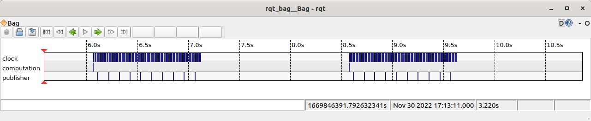

# Time Simulation

The code for this is on the `time_simulator` branch.

## Standard Time
 * In one terminal, run `ros2 run toy_threads slow_computation --ros-args -p use_sim_time:=True`
   * This runs two loops, `computation` which should be run every second, but instead takes 2.5 seconds.
   * It will wait for sim_time to be published.
 * In the second terminal, run `ros2 run toy_threads time_simulator`.
   * All this node does is use the `threading` library to publish a `/clock` message every 0.01 seconds.

The result will be that the `computation` task runs at ~0.4 Hz.

## Slowing Down Time for Computation
 * Run the same command as the first terminal above: `ros2 run toy_threads slow_computation --ros-args -p use_sim_time:=True`
   * Note that each task publishes an `Empty` message when the task is complete.
 * In the second terminal, run `ros2 run toy_threads waiting_time_simulator`
   * This will only publish the `/clock` message when it has received a message indicating that `computation` is done.

The result is that `computation` task runs at ~0.95 Hz (close enough) according to ROS time, but in real time, it takes the standard 2.5 seconds.

The above shows when the messages arrived in real time. You can see that the `computation` message is only published every 2.5 seconds, and the `clock` and `publisher` are published in one second chunks, and then they wait for time to catch up.
